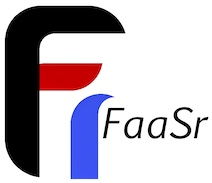

# Introduction and Overview

FaaSr is serverless Function-as-a-Service cloud software that makes it easy for 
developers to create functions and compose them in workflow graphs that can run 
unattended and on-demand

FaaSr simplifies deploying reproducible FaaS workflows in different cloud providers 
without any code changes, with a primary use case in scientific workflows

## Cloud platforms

FaaSr supports the following cloud computing platforms:

- __[GitHub Actions]__ - free-tier resources for small-scale workflows
- __[AWS Lambda]__ - commercial cloud for scalable, low-latency worrkflows
- __[Google Cloud Run]__ - commercial cloud for resource-intensive workflows
- __[OpenWhisk]__ - open-source FaaS platform for private clouds
- __[Slurm]__ - open-source job schedulers for private HPC clusters

[GitHub Actions]: https://github.com/features/actions
[AWS Lambda]: https://aws.amazon.com/pm/lambda
[Google Cloud Run]: https://cloud.google.com/run
[OpenWhisk]: https://openwhisk.apache.org/
[Slurm]: https://slurm.schedmd.com/

and the S3 protocol for cloud storage in platforms including:

- __[Minio]__ - open-source S3 software
- __[AWS S3]__ - commercial S3 provider
- __[OSN]__ - academic S3 provider in the USA

[Minio]: https://www.min.io/
[AWS S3]: https://aws.amazon.com/pm/serv-s3
[OSN]: https://openstoragenetwork.github.io/docs/portal/

## Programming languages

FaaSr supports workflows with functions written in Python, R, or a combination of both

## Requirements

To get started with FaaSr you need:

- A GitHub account and associated [credentials] (a PAT token)
- An S3 data store bucket and associated [credentials] (access and secret keys)
- A FaaSr-workflow GitHub repository in your account
- A workflow configuration JSON file stored in your account's FaaSr-workflow repository
- A function code repository

## Getting started 

It's often easier to learn by doing: read the [workflow model] introduction for a brief overview of how FaaSr workflows are composed, and then the [FaaSr tutorial] guides you through setting up your ]workflow repo] using a freely available public S3 test bucket hosted by __[Minio Play]__. Once you are comfortable with the initial setup from the tutorial, you will be able to:

- Configure additional [cloud compute] and [data storage] accounts
- Create your own [functions] using [FaaSr R APIs] and/or [FaaSr Python APIs]
- Configure your own workflows using the [FaaSr Workflow Builder Web UI] that produces FaaSr-compliant JSON configurations
- [Register] your own workflows with one or more cloud providers
- [Invoke] your workflows
- Verify and debug your workflow [logs]

[workflow model]: prog_model.md
[FaaSr tutorial]: tutorial.md
[cloud compute]: workflows.md
[data storage]: workflows.md
[credentials]: credentials.md
[workflow repo]: workflow_repo.md
[functions]: functions.md
[FaaSr R APIs]: r_api.md
[FaaSr Python APIs]: py_api.md
[workflows]: workflows.md
[FaaSr Workflow Builder Web UI]: workflows.md
[Register]: register_workflow.md
[Invoke]: invoke_workflow.md
[logs]: logs.md
[Minio Play]: https://play.min.io/
