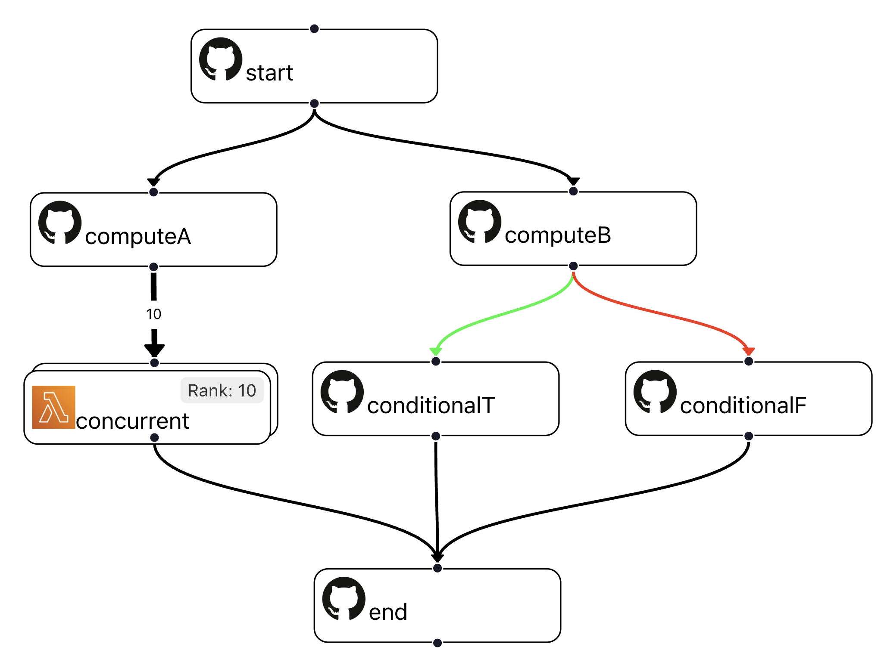
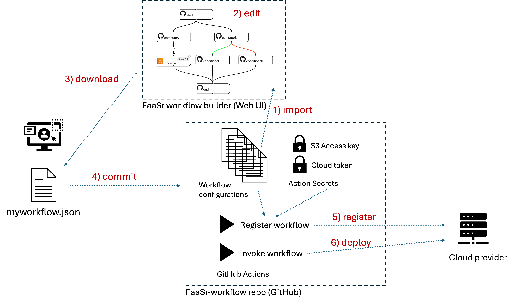

# FaaSr workflow model

The FaaSr model for programming, configuring, and deploying workflows is as follows:

- **FaaSr Workflow DAG**: describes the order in which your functions execute. Valid workflows must be _Directed Acyclic Graphs (DAG)_ (i.e. no loops) with a _single invocation entry_, and are described as a _JSON file_
- **Action**: each node in the DAG is an _Action_ that represents the execution of a _user function_ in a _container_ deployed at runtime in a serverless cloud provider (e.g. a GitHub Action, or AWS Lambda)
- **Function**: once deployed, each _Action_ executes a user-defined _Function_ in the contaier. A _Function_ is written in a high level language and published as a .R or .py file in a _GitHub Function repo_. A _Function_ takes *input arguments* and returns either true (successful excecution) or false (unsuccessful execution)
- **Input/output**: a serverless _Action_ is _stateless_: the local memory and storage in a container is discarded when the _Action_ completes. Therefore, all data that must persist across invocations must be stored as _files_ in one or more S3 cloud *data servers*. FaaSr provides an *Application Programming Interface (API)* to store/retrieve files to/from S3 for this.

## Workflow DAG example

To illustrate how a FaaSr workflow DAG works, consider the example below:

- This DAG has seven _Actions_, where the _invocation entry_ is a node named _start_
- Action _start_ has two successor actions: _computeA_ and _computeB_; this means that when _start_ finishes executing, both _computeA_ and _computeB_ are invoked, concurrently
- Action _computeA_ invokes *ten instances* of action _concurrent_; each of these actions is provided with a unique _Rank_ (in this example, a number from 1 to 10)
- Action _computeB_ invokes either _conditionalT_ or _conditionalF_, depending on whether _computeB_ returns True or False, respectively
- Finally, action _end_ only executes after all its predecessors in the DAG finish their execution - i.e. after all 10 instances of _concurrent_ and either _conditionalT_ or _conditionalF_ finish
- In this DAG, the _concurrent_ actions execute as AWS Lambdas, while all other actions execute as GitHub Actions

## Actions, functions, and input/output files

The example workflow DAG above names which actions should execute, and in which order. Each action is essentially a container (e.g. a _Docker_ instance) that is deployed on a serverless cloud provider - which means these actions are invoked, execute for some time, then are terminated. Let's dive deeper now into: how to define which _Function_ each action executes? How to save and retrieve _inputs and outputs_?

- Action _computeA_ runs a function written in R, while _concurrent_ runs a function written in Python. These stored in (one or more) _GitHub function repo(s)_ and are fetched automatically by the action when it is invoked
- Actions can read input files and write output files to (one or more) _S3 data server(s)_. the _FaaSr API_ provides functions in R and Python to put files to/get files from data server(s). The FaaSr API simplifies the programming of functions to use data from S3, without exposing you (the programmer or user) to details on how to access S3
- In general, the bulk of the data in a workflow consists of files; function *arguments* are used for configuration (e.g. of parameters, file and folder names)
- The typical file access pattern is as follows: 1) an action starts; 2) the action _gets_ input file(s), copying them from persistent S3 storage into its local temporary storage; 3) the action produces output file(s) in its local non-persistent storage; 4) the action _puts_ its output file(s) to persistent S3 storage; and 5) the action ends 

## Creating, editing, registering and invoking workflows

We've seen what the workflow DAG represents (actions and their orders) and we also have seen that workflow DAGs themselves are stored in files in the JSON format. Putting it all together, we need ways to: 1) create and edit workflow JSON files using the _FaaSr workflow builder_ Web graphical user interface; 2) store these workflow JSON configuration files in a _FaaSr-workflow repository_ on GitHub; and 3) _register_ and _invoke_ these workflows in your cloud provider(s) of choice. Consider the example below that illustrates how this process typically works:

- The user first needs to fork the _FaaSr-workflow repo_ from the FaaSr organization. This will be your main environment for managing all your workflows (you can also have multiple workflow repos, though typically a single repo will suffice)
- Let's assume the user already has one or more workflows in this repo (e.g. the tutorial workflow). Then the user can use the FaaSr workflow builder to 1) _import_ the workflow JSON file from their FaaSr-workflow repo; 2) _edit_ with the Web UI; 3) _download_ the JSON file to their computer; 4) _commit_ the JSON file to their workflow repo; 5) _register_ the workflow with their cloud provider(s); and 6) _invoke_ the workflow so it executes in the cloud
- Once a workflow is registered, it can be invoked multiple times, either as manual, user-initiated one-shot invocations, or as an automatic, unattended periodic timer invocation
- The registration and invocation of workflows are themselves implemented as GitHub Actions inherited from the forked _FaaSr-workflow repo_
- The _FaaSr-workflow repo_ also stores _Secrets_ which are the credentials needed to access your cloud provider(s) of choice

## Container images and package dependences

- FaaSr provides a set of base images for containers with runtime environments for both Python and R, and deployable on the supported cloud providers. These images are typically sufficient for most use cases.
- If a function needs additional packages (e.g. from CRAN, PyPI), those can be declared in the workflow JSON configuration and fetched automatically.
- If a function needs a custom container image, the user can create their own custom container image(s), copy them to the appropriate container registry (e.g. DockerHub, GHCR, ECR), and also declare them in the workflow JSON configuration

